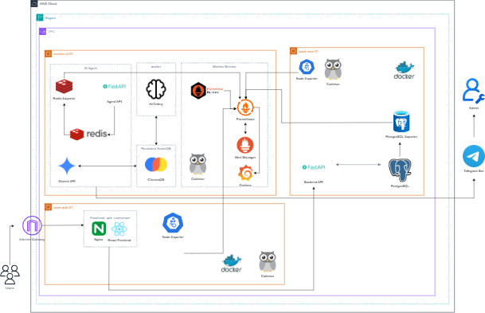

# Cloud-Based AIOps System for Network Incident Detection and Alerting

This repository implements a small but complete AIOps platform on AWS EC2. It combines infrastructure provisioning, host configuration, monitoring, an AI incident agent, a demo banking application, and a CI/CD release flow with health checks and automatic rollback.

The project is designed around clear operational boundaries:

- Terraform owns cloud resources.
- Ansible owns host bootstrap and runtime configuration.
- GitHub Actions builds and publishes versioned container images.
- EC2 hosts only pull and run release artifacts.
- `automation/app-release-deploy.sh` is the single release gate for staging and production.



## What This System Does

The system monitors a distributed demo application and sends infrastructure or service incidents to an AI Agent. The agent deduplicates repeated alerts, retrieves relevant runbooks from ChromaDB, uses Gemini when configured, sends an actionable Telegram report, and verifies the incident again after a short delay.

The repo also includes a role-based CI/CD pipeline. Changes to the AI agent, backend, or frontend build only the affected image and deploy only the affected EC2 role in staging. Production releases are driven by `v*` Git tags.

## Architecture

The system has four main layers.

| Layer | Source | Responsibility |
|---|---|---|
| Infrastructure | `terraform/` | VPC, subnets, security groups, Elastic IPs, and three EC2 hosts |
| Host configuration | `ansible/` | Docker, monitoring stack, release runtime files, dashboards, exporters |
| Application runtime | `agent_src/`, `demo-web/`, `release/` | AI Agent, Celery worker, log watcher, Payment API, PostgreSQL, Redis, frontend |
| Delivery | `.github/workflows/`, `automation/` | CI validation, image build/push, role-based deployment, health checks, rollback |

The EC2 roles are separated by responsibility:

| Role | Host | Main services |
|---|---|---|
| `monitor` | `monitor-ai-01` | Prometheus, Alertmanager, Grafana, Redis, AI Agent, Celery worker, log watcher |
| `core` | `bank-core-01` | Payment API, PostgreSQL, Postgres exporter |
| `web` | `bank-web-01` | React frontend served by Nginx |

Staging and production can run at the same time on the same EC2 hosts because they use different ports, compose projects, environment files, and state files.

| Service | Staging health | Production health |
|---|---|---|
| AI Agent | `http://127.0.0.1:18000/health` | `http://127.0.0.1:8000/health` |
| Payment API | `http://127.0.0.1:18080/api/health` | `http://127.0.0.1:8080/api/health` |
| Frontend | `http://127.0.0.1:18081/health` | `http://127.0.0.1:3000/health` |

## Alert Flow

```text
Prometheus / Blackbox / service monitor
  -> Alertmanager
  -> AI Agent /webhook
  -> Redis queue
  -> Celery process_alerts_task
  -> deterministic runbook or RAG context
  -> Gemini analysis when needed and configured
  -> Telegram incident report
  -> delayed verification through Prometheus
  -> incident memory saved to ChromaDB when applicable
```

Important behavior in the alert path:

- The webhook validates Alertmanager payloads and enqueues work instead of doing long processing inline.
- Ingress deduplication uses `alert-ingress-cooldown:<identity>` with `ALERT_INGRESS_DEDUP_SECONDS`.
- AI processing deduplication uses `alert-ai-cooldown:<identity>` with `ALERT_AI_COOLDOWN_SECONDS`.
- Alert identity prefers Alertmanager `fingerprint`; otherwise it hashes labels such as `alertname`, `instance`, `job`, `service`, and `target`.
- `resolved` alerts clear cooldown and can send a recovery notification.
- The Celery worker handles alert batches with bounded concurrency via `ALERT_BATCH_CONCURRENCY`.

## AI Agent and RAG

The AI Agent is a FastAPI application at `agent_src/core/main.py`. Release compose splits the agent runtime into separate containers:

| Container | Role |
|---|---|
| `ai-agent-*` | FastAPI API, webhooks, health, metrics, tool/runbook draft endpoints |
| `celery-worker-*` | Alert processing, Gemini calls, RAG lookup, verification tasks |
| `log-watcher-*` | Log monitoring and webhook forwarding |

RAG uses ChromaDB through `agent_src/core/rag_engine.py`.

| Collection | Purpose |
|---|---|
| `standard_runbooks` | Reviewed Markdown runbooks from `agent_src/config/knowledge_base/*.md` |
| `incident_memory` | Runtime incident history and accepted/revised admin feedback |

Gemini defaults are intentionally conservative to reduce quota risk during alert storms:

```env
GEMINI_MODEL=gemini-2.5-flash
GEMINI_FALLBACK_MODELS=
GEMINI_MAX_ATTEMPTS=1
GEMINI_MAX_REMOTE_CALLS=1
```

For known alerts such as `WebEndpointDown`, `FrontendAPIProxyDown`, `PaymentAPIEndpointDown`, `PostgreSQLDown`, `RedisDown`, and `DockerContainerDown`, the worker can produce deterministic diagnosis from runbook templates before relying on an LLM.

## Demo Application

`demo-web/` contains a simple banking web application used as the monitored workload.

| Component | Source | Notes |
|---|---|---|
| Frontend | `demo-web/frontend/` | React app packaged into an Nginx image |
| Backend | `demo-web/backend/` | FastAPI service named "VietTien Digital Banking API" |
| Database | `demo-web/database/` | SQL init and seed scripts mounted by release compose |

The backend has two different health endpoints:

- `/api/health` checks process liveness.
- `/api/ready` checks readiness, including PostgreSQL connectivity.

These endpoints are intentionally separate. A process can be alive while the database dependency is unavailable.

## CI/CD and Release Flow

CI runs on pull requests to `develop` and `main`, and on pushes to `feature/**`, `develop`, and `main`.

```text
Checkout
  -> setup Python 3.11
  -> install dependencies
  -> ruff critical-rule lint
  -> AI Agent tests
  -> Backend tests
  -> build AI Agent image
  -> build Payment API image
  -> build Frontend image
  -> validate staging and production compose files
```

The local equivalent is:

```bash
ruff check agent_src demo-web/backend/app --select E9,F63,F7,F82
PYTHONPATH=agent_src pytest -q agent_src/tests
PYTHONPATH=demo-web/backend pytest -q demo-web/backend/tests
docker build -t local/ai-agent:ci agent_src
docker build -t local/payment-api:ci demo-web/backend
docker build -t local/frontend:ci demo-web/frontend
cp release/.env.example release/.env.staging
cp release/.env.example release/.env.production
docker compose -f release/docker-compose.staging.yml config > /dev/null
docker compose -f release/docker-compose.production.yml config > /dev/null
```

Staging deployment is role-based. `cd-staging.yml` maps changed paths to deploy roles:

| Changed path | Role | Image |
|---|---|---|
| `agent_src/` | `monitor` | `aws-hybrid-ai-agent` |
| `demo-web/backend/`, `demo-web/database/` | `core` | `aws-hybrid-payment-api` |
| `demo-web/frontend/` | `web` | `aws-hybrid-frontend` |
| `release/`, `automation/`, workflow file | all roles | all release images |

Production deployment runs when a tag matching `v*` is pushed, or through manual workflow dispatch with a release tag.

## Rollback Strategy

`automation/app-release-deploy.sh <staging|production> <image-tag> <monitor|web|core>` is the release gate used by GitHub Actions.

For each deployment it:

1. Validates environment and deploy role.
2. Loads the correct compose file and env file.
3. Logs in to GHCR when credentials are provided.
4. Saves the previous deployed tag in `release/.state/<environment>.tag`.
5. Pulls only the services required for the target role.
6. Starts the role services with Docker Compose.
7. Runs role-specific health checks for up to 18 attempts, waiting 10 seconds between attempts.
8. Writes the new tag to the state file only after health checks pass.
9. Rolls back to the previous tag if the new version fails health checks.

Role-specific service ownership:

| Role | Services deployed |
|---|---|
| `monitor` | `redis`, `redis-cache`, exporters, `ai-agent`, `celery-worker`, `log-watcher` |
| `core` | `postgres`, `postgres-exporter`, `payment-api` |
| `web` | `frontend-web` |

Manual rollback uses the same compose files and the previous tag stored in `release/.state/`.

## Running Locally

The local development stack is separate from the release path:

```bash
docker compose -f platform-config/docker-compose.dev.yml up -d
```

This starts the development monitoring and app stack defined in `platform-config/docker-compose.dev.yml`. It is useful for local validation, but production releases should use CI-built GHCR images and `automation/app-release-deploy.sh`.

## Deployment Bootstrap

A new AWS environment follows this high-level order:

```text
Terraform apply
  -> update Ansible inventory
  -> Ansible bootstrap
  -> configure monitoring stack
  -> configure release runtime files
  -> configure GitHub Secrets
  -> push develop for staging or push v* tag for production
```

Useful commands:

```bash
cd terraform
terraform init
terraform validate
terraform plan -out=tfplan
terraform apply tfplan
terraform output -raw ansible_inventory > ../ansible/inventory.ini
cd ..
ansible all -i ansible/inventory.ini -m ping
ansible-playbook -i ansible/inventory.ini ansible/playbooks/bootstrap.yml
ansible-playbook -i ansible/inventory.ini ansible/playbooks/configure-monitoring-stack.yml
ansible-playbook -i ansible/inventory.ini ansible/playbooks/configure-release-runtime.yml
```

If the operator public IP changes, use:

```bash
bash automation/update-infrastructure.sh
```

## Verification Commands

Agent health:

```bash
curl -fsS http://127.0.0.1:18000/health
curl -fsS http://127.0.0.1:8000/health
```

Payment API health and readiness:

```bash
curl -fsS http://127.0.0.1:18080/api/health
curl -fsS http://127.0.0.1:18080/api/ready
curl -fsS http://127.0.0.1:8080/api/health
curl -fsS http://127.0.0.1:8080/api/ready
```

Frontend health through Nginx:

```bash
curl -fsS http://127.0.0.1:18081/health
curl -fsS http://127.0.0.1:3000/health
```

RAG inspection from a running release worker:

```bash
docker exec celery-worker-staging python tools/inspect_rag_db.py
docker exec celery-worker-staging python tools/inspect_rag_db.py --collection standard_runbooks
docker exec celery-worker-staging python tools/inspect_rag_db.py --collection incident_memory
```

## Important Configuration

Release environment values are based on `release/.env.example`. GitHub Actions creates `.env.staging` and `.env.production` during deployment and fills values from repository secrets or inventory-derived defaults.

Important variables include:

| Variable | Purpose |
|---|---|
| `GHCR_OWNER` | GitHub user or organization that owns the images |
| `IMAGE_TAG` | Release image tag supplied by workflow or deploy script |
| `DATABASE_URL` | Backend database connection string |
| `PAYMENT_API_UPSTREAM` | Frontend Nginx upstream to the Payment API |
| `PROMETHEUS_URL` | Prometheus API endpoint used by verification |
| `GEMINI_API_KEY` | Enables Gemini analysis |
| `TELEGRAM_TOKEN`, `TELEGRAM_CHAT_ID` | Enables Telegram notifications and feedback |
| `AI_AGENT_PUBLIC_URL` | Public HTTPS URL for Telegram webhook registration |
| `GITHUB_WEBHOOK_SECRET` | HMAC secret for `/github/webhook` |
| `GITHUB_DISCOVERY_TOKEN` | Optional token for GitHub changed-file discovery |

Never commit `.env*`, Terraform state, SSH keys, API tokens, or runtime ChromaDB data.

## Repository Layout

```text
.
|- agent_src/              # AI Agent, Celery tasks, RAG engine, tests, diagnostic tools
|- ansible/                # EC2 bootstrap, monitoring, dashboard, and release runtime playbooks
|- automation/             # Deploy, infrastructure update, role deploy, Telegram notification scripts
|- demo-web/
|  |- backend/             # FastAPI Payment API
|  |- frontend/            # React frontend packaged with Nginx
|  `- database/            # PostgreSQL init and seed scripts
|- platform-config/        # Local development compose and monitoring config
|- release/                # Staging/production compose files and env template
|- terraform/              # AWS infrastructure definition
|- assets/                 # README images
|- AIops_CICD.md           # CI/CD design notes
|- AWS_INFRASTRUCTURE_DEPLOYMENT_GUIDE.md
|- GITHUB_WEBHOOK_TOOL_REGISTRY_RUNBOOK_DEMO.md
|- STAGING_DEMO_RUNBOOKS.md
`- README.md
```

## Operational Boundaries

- Do not build production images on EC2.
- Do not copy application source to EC2 for release.
- Do not bypass `automation/app-release-deploy.sh` for staging or production deployment.
- Do not merge staging and production port mappings.
- Keep `httpx<0.28` for FastAPI `TestClient` compatibility.
- Use `google-genai`, not `google-generativeai`.
- Do not commit `agent_src/vector_db/`; it is runtime ChromaDB data.

## Further Reading

- [AIops_CICD.md](AIops_CICD.md)
- [AWS_INFRASTRUCTURE_DEPLOYMENT_GUIDE.md](AWS_INFRASTRUCTURE_DEPLOYMENT_GUIDE.md)
- [GITHUB_WEBHOOK_TOOL_REGISTRY_RUNBOOK_DEMO.md](GITHUB_WEBHOOK_TOOL_REGISTRY_RUNBOOK_DEMO.md)
- [STAGING_DEMO_RUNBOOKS.md](STAGING_DEMO_RUNBOOKS.md)
- [agent_src/README.md](agent_src/README.md)
